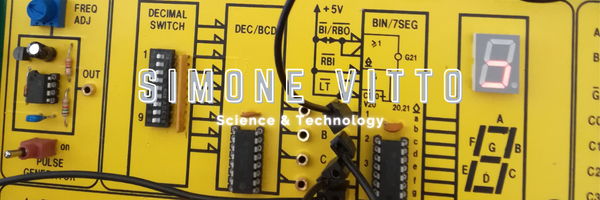

# Welcome 

## About me:
<table align="right">
	<th>Languages</th>
	<tr>
		<td>🇮🇹 Italian</td>
	</tr>
	<tr>
		<td>🇬🇧 English</td>
	</tr>
  <tr>
    <td>🇩🇪 German (Learning)</td>
  </tr>
</table>

Hi, I'm a **Developer** and **CyberSecurity Enthusiast**💻.
I have work experience in **ATM🏧 software development** and I am always ready to learn new things.

### 🛠️ I like working on 🛠️:
- 🔧 Raspberry Pi & Arduino Projects 🪛
- 👨‍💻 CyberSecurity Projects 👨‍💻
- 📱 Android Apps 📱

### 🧗 Other things I like 🧗:
- 🚩 Partecipate in CTFs 🚩
- 💡 Electronics 💡
- ⛺ Hiking & Biking 🚵‍♂️

### 🌱 I'm currently learning 🌱:
- 🧠 Neural Networks & Artificial Intelligence 🧠

Check out my Hash Decrypter app on Google Play:

### 📫 How to reach me 📫:

## Support me:

